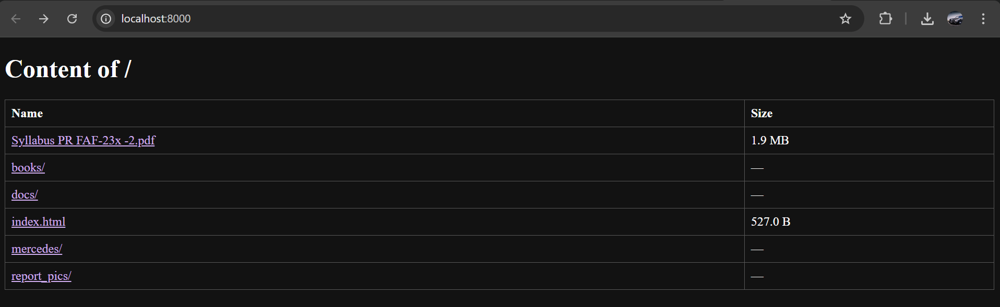

# LAB_PR
# LAB 1 PR: HTTP file server with TCP sockets
During this laboratory work I developed a simple HTTP file server in Python, where I can browse the directory for nested directories or files.

## Contents of Directory
* I have multiple directories in the root. *Downloads* directory is where files are saved using the client. *Public* contains other nested directories, as well as some html, png and pdf files for testing. The other nested directories(*books, docs*) also feature png, html and pdf files for testing. *Report_pics* directory contains images used in this report. 
* In this project, the *Dockerfile* defines how the server and client environments are built, including the necessary dependencies and instructions to run the Python applications inside containers. The *docker-compose.yml* file is used to coordinate these containers, starting both the server and client, linking them together, mapping the appropriate ports, and managing shared volumes.
* The *server.py* file handles incoming HTTP requests, retrieves the requested files from the specified directory, and sends them back to the client.
* The *client.py* connects to the server, sends file requests, and displays or saves in the *downnloads* folder the received content based on the file type.

    

## Dockerfile
The *Dockerfile* makes sure to set a lightweight Python 3.12 environment, copies the server and client scripts into the container’s /app directory, sets it as the working directory, and exposes port 8000 so server.py/client.py can use it.
```dockerfile
FROM python:3.12-slim
WORKDIR /app
COPY server.py client.py ./
EXPOSE 8000
```

## Docker compose
This *docker-compose.yml* file defines two services: a server that runs server.py on port 8000 to host files, and a client that runs client.py to connect to the server,while managing their shared volumes and ensuring the server starts before the client.

```dockerfile
services:
  server:
    build:
      context: .
      dockerfile: Dockerfile
    container_name: pr-web-server
    environment:
      PORT: 8000
    ports:
      - "8000:8000"
    volumes:
      - ./:/app
    command: ["python", "server.py", "/app/public"]

  client:
    build:
      context: .
      dockerfile: Dockerfile
    command: ["python", "client.py", "server", "8000", "/app/public"]
    depends_on:
      - server
```

## Running the project
We can run the project locally using the command:
```python
python3 server.py <path_to_directory>
```
In the following picture you can see an example of how i can run the project locally with the *root* directory of the project as an argument:


We can run it using docker with the following command:
```
docker compose up server
```

## Content of served directory
If we serve the root we will see the following files and directories in the browser. We can see all types of files, but can access only png, html, pdf files.


## Requesting files
* We can request a **png** file in the browser by accessing its path or by navigating to it through the folders in the listings.

  
  We can observe using Inspect in the Network tab that the response for the png request was successful (200 OK).
  
* To request a **pdf** file we do the same as for the png file.


* We can also request a  **html** and we will see the html page in the browser.


* If we request an inexistent file or a file with an extension  that is not permitted, we will get the 404 page. We can also click on the *homepage* button to go back to the root directory list.


## Client
We can run the client using docker:
```
docker compose run --rm client server 8000 lucrare.pdf
```
And we will get the file saved in the *downloads* folder.

## Download items
We can download items using the following commands:
```
New-Item -Path "downloads" -ItemType Directory -Force

Copy-Item -Path "public\mercedes\mercedes1.jpg" -Destination "downloads\" -Force

Get-ChildItem -Path "downloads"
```
As you can see the mercedes1.png saved into downloads folder:

>>>>>>> 9808c62 (Completed LAB1)
